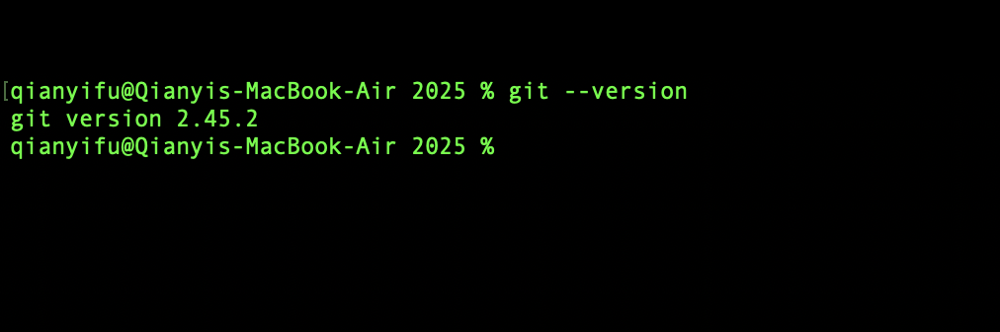
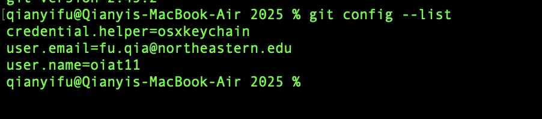
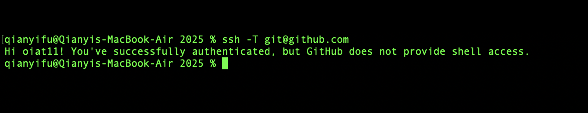

# Lab 1 (25 marks)

[View Lab Instructions Here](L1.md)

[How to use Github / How to submit](https://parsa-rajabi.github.io/CS-5500/#/labs?id=github-classroom)

For this lab, you will include all of your "answers" in this README file. Make sure to cite any sources you use. 

Reminder, this is the syntax to include an image in a markdown (`.md`) file:
```markdown


Example - if a file called test.png was located in this folder:

```

## Task 0: Declare your AI Usage

After you completed this lab, make sure to submit the AI declaration form via MS Form and also upload a PDF copy of your responses to this repository and include the link to PDF in this README file. Note, you must submit this form regardless if you use AI or not. Failure to submit this form will be considered a violation of AI course policy. More details about the AI-usage course policy can be found [here](https://parsa-rajabi.github.io/CS-5500/#/ai-policy).

[Link to AI Usage Disclosure MS Form](https://parsa-rajabi.github.io/CS-5500/#/ai-policy?id=disclosure-of-ai-use)

- You will need to log in with your SFU email to access the form. If you're unsuccessful, try using a different browser or incognito mode. Clearing your cache and cookies may also help.

Name the file in the following format: 

`L#_AI_Declaration_FirstName_LastName_StudentID.pdf`

Example (Lab 3):

`L3_AI_Declaration_Parsa_Rajabi_123456789.pdf`


More detailed submission instructions can be found via the [lab page](https://parsa-rajabi.github.io/CS-5500/#/labs).


## Task 1: Prepare your System (1 mark)

Include screenshots as described in the [Lab 1](L1.md) file.




## Task 2: GitHub Tutorial (24 marks)

Include screenshots as described in the [Lab 1](L1.md) file.


## Task 3: Lab Questions (11 marks)

Include answers as described in the [Lab 1](L1.md) file:

### Q1

Git is a version control software, and github is a location to uplaod copies of git repository

### Q2

It is a way to manage the code that when many computers work together, each computer can work locally and won't affect the code of the main repository, so that it's more convinient to merge the code together and won't cause conflicts.

### Q3

Modifies means there is there is a change occured to the file and the change is not staged yet. Staged means the changes are ready to commit and will be included next time we commit. Commited means the changes that are staged will be shown on the repository.

### Q4

#### Q4 (i)

clone a repository frrom a remote repository to your local

#### Q4 (ii)

check the status of the working directory and whether the files are stages yet

#### Q4 (iii)

to get the data from a remote repository but it doesn't merge the working directory to remote

#### Q4 (iv)

create a new git repository

#### Q4 (v)

shows the commits that has made in that repository

### Q5

It is a file that we include the name of those files that we don't wanna upload to remote repository. For example some credentials, API keys and other unnecessary stuff. So that when we commit git will ignore these files.

## Task 4: Video Questions (4 marks)

Include answers as described in the [Lab 1](L1.md) file.

### Q1

This video talks about 7 key points of software development lifecycle, including Planning Requirements, requirement analysis, design, implement, testing, depolyment and maintenence. And it also explains what's included in each of these phases. And also it mentions the different roles that is envolved in each phases.

### Q2

Because it sets a step by step guide that helps the developers to make sure the software is high quality and maintainable. And also to manage the risk and cost of developing. 